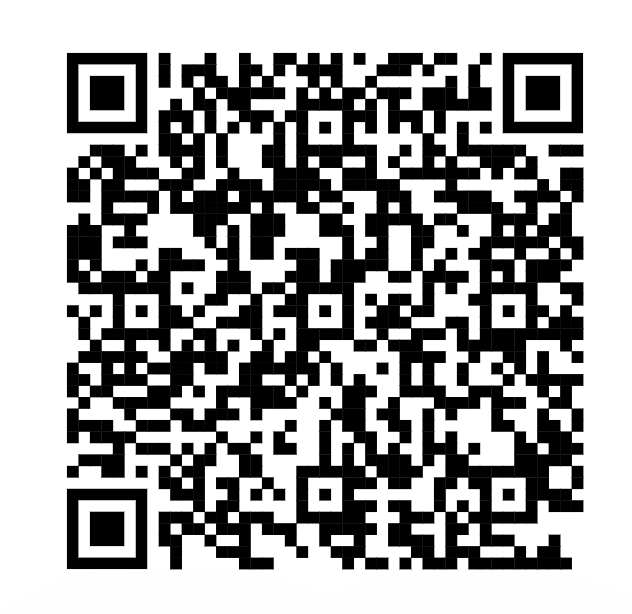
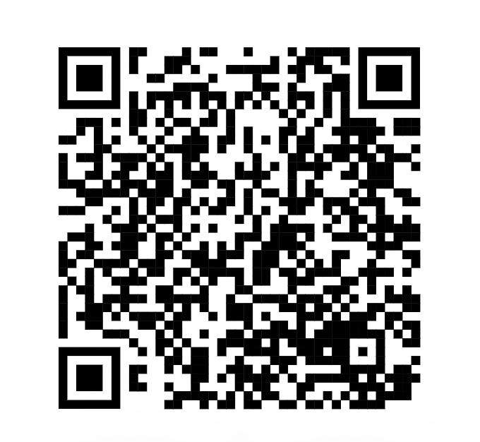

# Workshop: Angular - Zero to Hero

## Start the workshop



## Give feedback about the workshop




## Developing Locally

```
git clone https://github.com/DevSlam-2023-Angular/angular-zero-to-hero
```

[](https://stackblitz.com/github/DevSlam-2023-Angular/angular-zero-to-hero)
[](https://codesandbox.io/p/sandbox/github/DevSlam-2023-Angular/angular-zero-to-hero)

## 🚀 Project Structure

Inside of your Astro + Starlight project, you'll see the following folders and files:

```
.
├── public/
├── src/
│   ├── assets/
│   ├── content/
│   │   ├── docs/
│   │   └── config.ts
│   └── env.d.ts
├── astro.config.mjs
├── package.json
└── tsconfig.json
```

Starlight looks for `.md` or `.mdx` files in the `src/content/docs/` directory. Each file is exposed as a route based on its file name.

Images can be added to `src/assets/` and embedded in Markdown with a relative link.

Static assets, like favicons, can be placed in the `public/` directory.

## 🧞 Commands

All commands are run from the root of the project, from a terminal:

| Command                   | Action                                           |
| :------------------------ | :----------------------------------------------- |
| `npm install`             | Installs dependencies                            |
| `npm run dev`             | Starts local dev server at `localhost:4321`      |
| `npm run build`           | Build your production site to `./dist/`          |
| `npm run preview`         | Preview your build locally, before deploying     |
| `npm run astro ...`       | Run CLI commands like `astro add`, `astro check` |
| `npm run astro -- --help` | Get help using the Astro CLI                     |

## 👀 Want to learn more?

Check out [Starlight’s docs](https://starlight.astro.build/), read [the Astro documentation](https://docs.astro.build), or jump into the [Astro Discord server](https://astro.build/chat).
